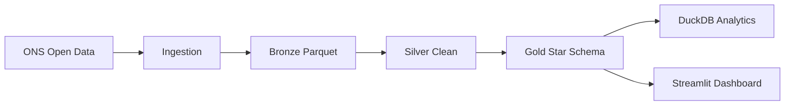

# ⚡ Energy Data Platform – End-to-End Data Engineering Project

Pipeline de dados com arquitetura **Bronze → Silver → Gold**, analytics em DuckDB e dashboard em Streamlit.

## 🚀 O que foi melhorado

- Parametrização por variáveis de ambiente (ano/URL/caminhos de dados).
- Ingestão com retry + timeout para maior robustez.
- Tratamento explícito para bronze vazio.
- Pipeline com execução por estágio (`--stage`).
- Pronto para publicação com Docker e CI/CD no GitHub Actions.

## 🧱 Arquitetura



## ⚙️ Requisitos

```bash
pip install -r requirements.txt
```

## ▶️ Como executar localmente

### 1) Rodar pipeline completo

```bash
python main.py --stage all
```

### 2) Rodar apenas um estágio

```bash
python main.py --stage ingestion
python main.py --stage silver
python main.py --stage modeling
python main.py --stage analytics
```

### 3) Rodar dashboard

```bash
streamlit run app.py
```

## 🌐 Publicar dashboard online

### Opção A — Streamlit Community Cloud

1. Suba este repositório no GitHub.
2. No Streamlit Cloud, crie app apontando para `app.py`.
3. Configure variáveis de ambiente (se necessário):
   - `INGESTION_YEAR`
   - `INGESTION_URL`
   - `BRONZE_DIR`, `SILVER_DIR`, `GOLD_DIR`, `ANALYTICS_DIR`

### Opção B — Docker (Render/Railway/Fly.io/EC2)

```bash
docker compose up --build
```

Isso sobe o dashboard na porta `8501`.

## 🐳 Docker

- `Dockerfile` para build da aplicação.
- `docker-compose.yml` para execução local rápida.

## 🔁 CI/CD com GitHub Actions

O workflow em `.github/workflows/ci-cd.yml`:

1. Roda testes (`pytest`).
2. Builda imagem Docker (incluindo em pull request, para validação).
3. Publica no GHCR somente em push no **branch padrão** do repositório (ex.: `main` ou `master`).

📌 Guia passo a passo pós-setup: `docs/NEXT_STEPS.md`.

## 🧪 Testes

```bash
pytest -q
```

## 🌍 Variáveis de ambiente úteis

- `INGESTION_YEAR` (default: ano atual UTC)
- `INGESTION_URL` (default: ONS para o ano configurado)
- `BRONZE_DIR` (default: `data/bronze/ena`)
- `SILVER_DIR` (default: `data/silver`)
- `SILVER_FILE` (default: `data/silver/ena_clean.parquet`)
- `GOLD_DIR` (default: `data/gold`)
- `ANALYTICS_DIR` (default: `data/analytics`)
- `FACT_FILE` (default: `data/gold/fact_ena.parquet`)
- `LOG_FILE` (default: `logs/pipeline.log`)
